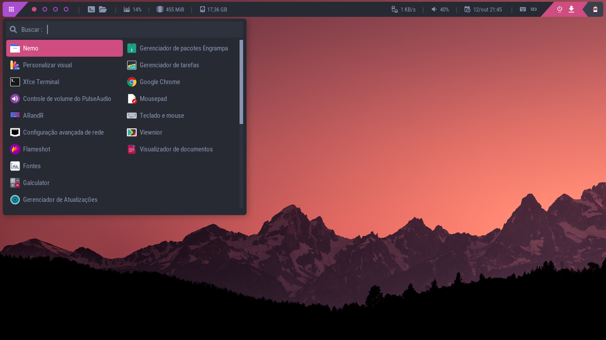

[🇧🇷 Versão em Português-Brasil](https://github.com/andregalastri/ainad/blob/main/README.pt_BR.md)

# ABOUT AINAD

AINAD is the initials of **AINAD Is Not A Distro**. It is a simple script that installs a series of applications and packages that create a minimal graphical environment ready to be used on Arch Linux.

---

**IMPORTANT: This project is in its early stages of development and it isn't production ready.**

---



<br />

# INSTALLATION

1. Install **Arch Linux** in **Minimal Install** mode using the `archinstall` command provided by Arch Linux itself;
1. After the installation, reboot the computer and logon using your user and password;
1. Run the following command:
    ```
    (source <(curl -L https://andregalastri.com.br/ainadinstall))
    ```
    > **ATTENTION:<br /> An internet connection is required.**
1. Choose your language;
1. Choose the option 1, inform your SUDO/ROOT password and wait the end of the installation.

<br />

# WHY AINAD IS NOT A DISTRO

Because it is simply a script that automates the installation and configuration of a minimal graphical environment for Arch Linux, and *that is it*. This was created for particular use, but was opened to anyone that want to try it.

At the end of the installation, the user will just be using Arch Linux and not some random distro maintained by a random person.

* AINAD is not, and does not intend to be, a Linux distro;
* It is just an automated package installer that creates a minimal and usable graphical environment for the user. It does nothing more than what the user could do by just running some commands manually;
* It does not guarantee that all things will work after the installation. Your hardware is different than mine. Bug reports are welcome. It is tested for basic uses, with common hardware;
* It also does not guarantee user support.

<br />

# WHICH PACKAGES ARE INSTALLED

AINAD uses the Arch Linux package manager **Pacman** and the package manager of the community **Yay** to install the programs. AINAD users the official repositories of Arch Linux and the user repositories of Arch Linux, the **AUR**.

<br />

* **XORG**

    *Packages* : `xorg-server xorg-xev`

    The good old **Xorg** server is the backend that draws the graphical environment on the screen of the user.
  
    **- Why not Waylad?**
 
    Wayland still has some incompatibilities with NVidia proprietary GPU drivers. AINAD does not intend to be as up-to-date as possible, its goal is to be stable, functional, and Xorg, in this case, is the best choice for now. Also, AINAD installs **Openbox** as window manager, which does not have an Wayland version.

<br />

* **SDDM**

    *Packages* : `sddm noto-fonts qt5-graphicaleffects qt5-quickcontrols2`

    **SDDM** is a beautiful and lightweight login manager. It allows the user to log into the computer through a pleasant and user-friendly visual.

    Along with SDDM, the Noto fonts and some QT5 packages, necessary for the theme [Sugar Candy de Marian Arlt](https://framagit.org/MarianArlt/sddm-sugar-candy), are installed.

<br />

* **KERNEL HEADERS**

    *Packages* : `linux-headers`

    The Linux headers work as an interface between the Kernel components and the userland. Some libraries, such as *sys-libs* and *glibc*, uses the Kernel headers. Other programs also use this package, but don't end up not putting it as a dependency. Because of that, it is good to have it installed by default. You can read more about it at [https://wiki.gentoo.org/wiki/Linux-headers](https://wiki.gentoo.org/wiki/Linux-headers).
    
<br />

* **OPENBOX**

    *Packages* : `openbox`

    **Openbox** is an extremely stable and lightweight window manager. Basically it communicates with Xorg to draw the windows and its contents on the screen. 

<br />

* **XDOTOOL**

    *Packages* : `xdotool`

    Utility that allows the automation of hotkeys and mouse via terminal commands.

<br />

* **MAN - MANUAL INTERFACE**

    *Packages* : `man-db`

    An terminal interface that allows the user to read reference manuals for many applications. It is good to have it installed because it is pretty default on many Linux installations.
    
<br />

* **PHP**

    *Packages* : `php php-intl php-sqlite`

    I know, I know, you don't like PHP, but I do, and I use it in all AINAD utilities.

    **- Why not the _programming language X Y Z_? Or just simple Bash scripts?**
 
    Because I probably don't know _programming language X Y Z_, or have little knowledge about it. I know a lot of PHP, so, that is it.
    
    I also use many of Bash scripts, but for some things it can be a pain in the ass to deal with, so, yeah, I mainly use PHP...
    
<br />

* **WMCTRL**

    *Packages* : `wmctrl`

    Allows to control windows, as well capture related data, via terminal commands.
    
<br />

* **XFCE4 TERMINAL**

    *Packages* : `xfce4-terminal`
    
    A good graphical terminal emulator. It is lightweight, easy to configure and have many customization options.

<br />

* **NEMO**

    *Packages* : `nemo cinnamon-translations`

    **Nemo** was chosen because it has its own file and directory search engine.

    It requires the Cinnamon translation package to support other languages.

<br />

* **FILE FORMAT SYSTEM AND OTHER INTEGRATIONS WITH FILE MANAGERS**

    *Packages* : `gvfs gvfs-nfs gvfs-mtp gvfs-gphoto2 gvfs-google gvfs-goa gvfs-afc ntfs-3g`

    Add resources to the file manager, like trash bin, mount driver and browsing files from network, as well supporting multiple file systems.

<br />

* **SAMBA**

    *Packages* : `samba gvfs-smb cifs-utils`

    Allows file and directory sharing in the network and access shares from Windows systems.

<br />

* **ENGRAMPA**

    *Packages* : `engrampa`

    Archive manager, like *tar*, *tar.gz*, etc.

<br />

* **MATE POLKIT**

    *Packages* : `mate-polkit`

    A simple polkit that allows an application to run commands as ROOT user when needed.

<br />

* **MOUSEPAD**

    *Packages* : `mousepad`

    A basic text editor.

<br />

* **NANO**

    *Packages* : `nano`

    A basic text editor for terminal.

<br />

* **QALCULATE**

    *Packages* : `qalculate-gtk`

    A good calculator.

<br />

* **NVIDIA DRIVERS**

    *Packages* : `nvidia nvidia-utils`

    Installs Nvidia proprietary drivers and utilities.

    **-Why not the open source driver?**
 
    In my tests, the proprietary Nvidia driver worked better.

    If the user prefers the open source driver, just uninstal these packages and install the package `xf86-video-nouveau`.
    
<br />

* **VMWARE DRIVERS**

    *Packages* : `virtualbox-guest-iso virtualbox-guest-utils xf86-video-vmware`

    Installs virtual machine drivers and utilities.

<br />

* **INTEL DRIVERS**

    *Packages* : `vulkan-intel xf86-video-intel`

    Installs Intel drivers.

<br />

* **AMD/ATI DRIVERS**

    *Packages* : `vulkan-radeon xf86-video-amdgpu xf86-video-ati`

    Installs AMD and ATI drivers. These packages are installed even if the user does not have AMD or ATI hardware installed because it consume a very low space amount.

<br />

* **NITROGEN**

    *Packages* : `nitrogen`

    AINAD configure utilities that use Nitrogen to set the desktop wallpaper.

<br />

* **GIT**

    *Packages* : `git`

    Required to install and use Yay.

<br />

* **PACMAN SCRIPTS**

    *Packages* : `pacman-contrib`

    A package containing adittional useful scripts. It is required because AINAD installs an utility that uses the command *checkupdates* to check and notify the user if there are new updates available.

<br />

* **GNOME KEYRING**

    *Packages* : `gnome-keyring`

    Applications like **VS Code** requires this package to use some features.

<br />

* **GTK2FONTSEL**

    *Packages* : `gtk2fontsel`

    A simple application that lists installed fonts.

<br />

* **DUNST**

    *Packages* : `dunst`

    A daemon to customize notification messages.

<br />

* **POLYBAR**

    *Packages* : `polybar dbus-python playerctl`

    An application that allows the creation of text-based bar panels. It is very lightweight and customizable. AINAD configures this bar by default.

    The `dbus-python` and `playerctl` packages are dependencies for a Polybar module called `polybar-now-playing`.
    
<br />

* **ROFI**

    *Packages* : `rofi dmenu`

    **Rofi** allows the creation of launchers and applets. AINAD configures many launchers, like App Menus, Updater Manager, Calendar, and others with Rofi. The package `dmenu` is required by Rofi to use some of its features.

<br />

* **FLAMESHOT**

    *Packages* : `flameshot`

    One of the best screenshot applications. Allows to take screenshots of parts of the screen and draw arrows and other figures on the screenshot.

    Um dos melhores programas de screenshot. Permite tirar screenshots de parte da tela, permite desenhar setas e outras coisas antes de tirar a screenshot, etc.

<br />

* **VIEWNIOR**

    *Packages* : `viewnior`

    A simple image viewer. It was chosen to be part of AINAD installer because it have integration with Nitrogen out of the box. It allows the user to apply the opened image as wallpaper.

<br />

* **XREADER**

    *Packages* : `xreader`

    A good PDF reader. Was chosen because it have features like annotations.

<br />

* **ARANDR**

    *Packages* : `arandr`

    A simple screen manager to change the layout of multiple displays. The only problem with it is that it doesn't have a way to change the refresh rate. That is why AINAD also install **Lxrandr**.

<br />

* **LXRANDR**

    *Packages* : `lxrandr`

    The only reason to install it is because **Xrandr** does not have the option to change the refresh rate of the screens.

<br />

* **LXTASK**

    *Packages* : `lxtask`

    A simple task monitor.

<br />

* **LXINPUT-GTK3**

    *Packages* : `lxinput-gtk3`

    A simple mouse and keyboard manager.

<br />

* **PAVUCONTROL**

    *Packages* : `pavucontrol`

    An advanced audio manager. Works on pulseaudio and pipewire.

<br />

* **XFCE4 POWER MANAGER**

    *Packages* : `xfce4-power-manager`

    A simple power manager.

<br />

* **LXAPPEARANCE**

    *Packages* : `lxappearance lxappearance-obconf`

    For now, it allows to manage the themes, icon themes and cursor themes, but will be replaced for a custom utility.

<br />

* **KVANTUM**

    *Packages* : `kvantum`

    Manages themes for QT applications.

<br />

* **QT SETTINGS**

    *Packages* : `qt5ct`

    Apply themes for QT applications.

<br />

* **NETWORK SETTINGS**

    *Packages* : `networkmanager nm-connection-editor`

    An advanced application for network configuration.

<br />

* **PICOM**

    *Packages* : `picom`

    An window compositor that allows to apply shadows, transparency, blur and round borders on windows and panels. It is one of many Compton forks, but it was the more stable during tests.

<br />

* **FONTS FROM OFFICIAL REPOSITORY**

    *Packages* : `noto-fonts-cjk noto-fonts-emoji`

    Installs some default fonts.

<br />

* **YAY**

    *Packages* : `yay`

    **Yay** is a helper that allows the installation of applications that are in the AUR, the Arch Linux User Repository. It works like Pacman, but the applications available are maintained by the community of Arch.

    **- IMPORTANT**

    Yay is not available in the official Arch Linux repository. Because of that, its package is instaled via compilation of its source code.

<br />

* **RAR**

    *Packages (AUR)* : `rar`

    Allows archive managers to support **.rar** files.

<br />

* **GOOGLE CHROME**

    *Packages (AUR)* : `google-chrome`

    Internet browser. It was chosen because it is the most popular. AINAD has no intend to be open source only.

<br />

* **WARSAW**

    *Packages (AUR)* : `warsaw-bin`

    Utility that is used on internet banking websites. It is installed by default because most of the internet banking websites don't explain how to install it properly on Arch systems.

<br />

* **PARCELLITE CLIPBOARD MANAGER**

    *Packages (AUR)* : `parcellite`

    A clipboard manager. Without it, the clipboard is not persistent.

<br />

* **DMENU FOR NETWORK MANAGER**

    *Packages (AUR)* : `networkmanager-dmenu-git`

    Allows launch some options of the **NetworkManager** throught dmenu, which allows to launch it via Rofi.

<br />

* **FONTS FROM AUR**

    *Packages (AUR)* : `ttf-roboto-mono ttf-roboto ttf-century-gothic`

    Installs some other fonts.
